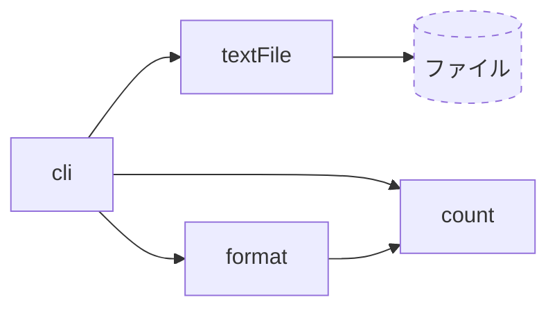
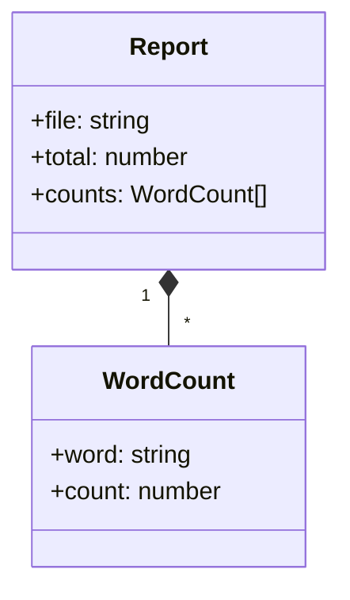

# 設計文書の書き方

各Iterationでは，テストリストを書いたあと，実装の前に設計文書を更新する．
実装のあとで設計文書と実装を見比べ，食い違いを直す．

テストリストと設計文書は，見ているものが違う．

- **テストリスト**は振る舞いを書く．「何をするか」である．
- **設計文書**は構造を書く．「どのモジュール，どの型，どの判断で実現するか」である．

## 3つの文書

各パッケージの`design/`に置く．記法はMarkdownの中のMermaidである．

| ファイル | 示すもの |
| --- | --- |
| `design/modules.md` | `src/`のモジュールと，どれがどれをimportするか．外部(promptfoo，Ollama，ファイル)との境界 |
| `design/types.md` | 主な型，そのフィールド，型どうしの関係 |
| `design/adr/NNNN-<題>.md` | 評価の方法についての判断を1件1ファイルで記録するADR(Architecture Decision Record) |

以下の例は，このコースとは関係のない小さなプログラム「ファイルの単語を数えるCLI`wordcount`」である．

### モジュール依存図



- ノードのIDは，`src/`の下のファイル名から`.ts`を除いたもの(`count.ts`なら`count`)である．
- 外部のノードには`:::external`を付ける．点線の枠で描かれ，照合から外れる．
- 実線の矢印`A --> B`は，`A`が`B`をimportすることを表す．型だけのimportも含む．1行に1本書く．
- 関係の深いモジュールは`subgraph`でまとめてよい．

解答パッケージでは，`scripts/check-design.mjs`が図の矢印と`src/`のimportを照合する．図にしかない矢印も，コードにしかないimportも，検証の失敗になる．

### 型



- フィールドの名前と型は，コードと同じにする．
- 1対多の関係には多重度(`"1" *-- "*"`)を書く．
- ユニオン型は`<<enumeration>>`のクラスとして，取りうる値を並べる．

### ADR

```markdown
# 0001 単語の区切りに空白と句読点を使う

## 状況
単語の数え方によって結果が変わる．日本語の文は空白で区切られない．

## 決定
空白と句読点で区切る．日本語の形態素解析は使わない．

## 理由
対象のファイルが英語の文書であり，依存を増やさずに済む．

## 影響
日本語の文書では，文が1語として数えられる．
```

- 1つのADRに1つの判断を書く．題は判断そのものを1文で書く．
- 「理由」には，採らなかった案と，採らなかった理由も書く．
- 判断を変えるときは，古いADRを書き換えず，新しいADRを加えて古いものを参照する．

## 約束

- 文書の中の名前は，コードの名前と同じにする．
- 1つの図には1つの視点だけを描く．
- 図の上に，何を示す図かを1〜2文で書く．
- 図で表せない約束は，図の下に箇条書きで書く．
- 文書は，プログラムの今の状態だけを示す．過去の経緯はADRに残す．

## プレビューと検査

VS Codeでは，Markdownのプレビュー(`Ctrl+Shift+V`)でMermaidの図が描かれる．

リポジトリのルートで，図の構文と，設計とコードの照合を検査できる．

```console
pnpm lint:mermaid
pnpm lint:design
```
