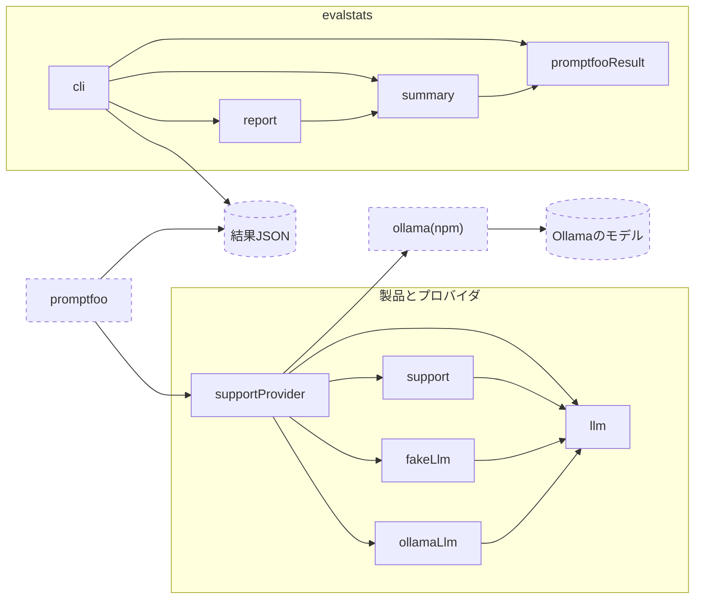

# モジュール依存図

製品側のモジュールはpromptfooから呼ばれ，分析側の`evalstats`はpromptfooが書いた結果JSONを読む．
実線の矢印`A --> B`は，`A`が`B`をimportすることを表す．点線の枠は外部である．

- 非決定的なのは，外部の`Ollamaのモデル`だけである．`support`は`llm`のインタフェースだけに依存するため，テストでは`fakeLlm`を渡して決定的に確かめられる．
- `supportProvider`は，設定の`llm`に応じて`fakeLlm`の`keywordLlm`か，`ollamaLlm`と`ollama(npm)`のクライアントを組み立てる．
- `evalstats`は製品のモジュールをimportしない．promptfooの結果JSONだけを通して製品の評価結果を受け取る．
