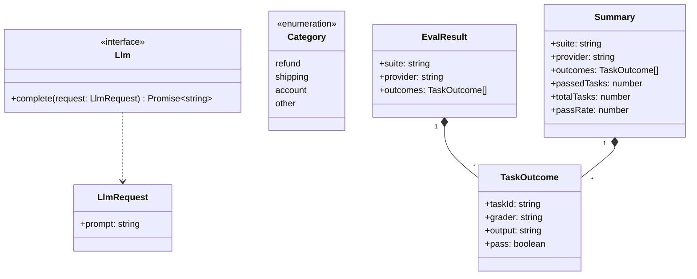

# 型

製品側の型(`Llm`，`Category`)と，`evalstats`が結果JSONから作る型(`EvalResult`，`TaskOutcome`，`Summary`)を示す．

- `classifyInquiry`は`Category`か`"invalid"`を返す．`"invalid"`は，LLMの出力がどのカテゴリにも当たらなかったことを表す．
- `TaskOutcome`は，1つのタスクを1つの採点器で採点した結果である．`grader`は，promptfooのアサーションの`metric`(なければアサーションの種類)である．
- `Summary`の`passedTasks`は，すべての採点器に合格したタスクの数である．
