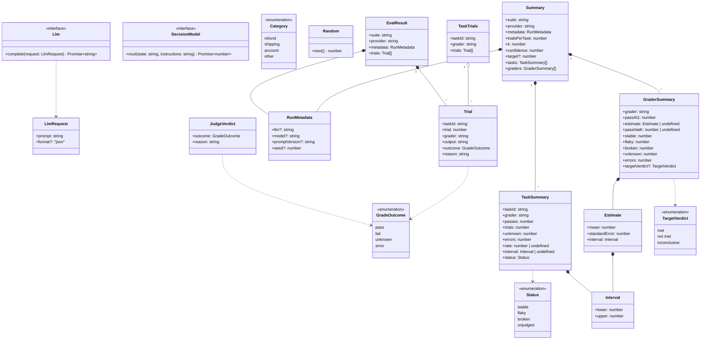

# 型

製品側の型(`Llm`，`Category`，`Random`)，採点器の型(`JudgeVerdict`，`DecisionModel`)と，`evalstats`が結果JSONから作る型を示す．
`evalstats`は，試行(`Trial`)をタスクと採点器ごとにまとめ(`TaskTrials`)，タスクごとの集計(`TaskSummary`)と採点器ごとの集計(`GraderSummary`)を作る．
集計は，区間(`Interval`)と，平均の標準誤差と区間(`Estimate`)を持つ．

- `classifyInquiry`は`Category`か`"invalid"`を返す．`"invalid"`は，LLMの出力がどのカテゴリにも当たらなかったことを表す．
- `Trial`は，1回の試行を1つの採点器で採点した結果である．`trial`は同じタスクの試行の中での1からの番号，`grader`はpromptfooのアサーションの`metric`(なければアサーションの種類)である．
- `GradeOutcome`の`unknown`は採点器が判断できないと答えたこと，`error`は採点できなかったこと(Judgeの応答が読めない，LLMの呼び出しの失敗など)を表す．自作のアサーションは採点の結果をメタデータの`outcome`に残し，ほかのアサーションは合否から`pass`か`fail`になる．
- `TaskSummary`の`trials`は判定できた(`pass`か`fail`の)試行の数であり，合格率と区間はその中で求める．判定できた試行がなければ，合格率と区間は`undefined`，状態は`unjudged`になる．
- `RunMetadata`は，プロバイダが出力のメタデータに残した記録である．結果ごとに違う値は，重複を除いてカンマでつなぐ．`seed`は偽LLMを使ったときだけ記録される．
- `TaskSummary`の`interval`は，そのタスクの合格する確率の信頼区間(Clopper-Pearson法)である．
- `GraderSummary`の`passAt1`はタスクごとの合格率の平均，`estimate`はその標準誤差と信頼区間，`passHatK`はタスクごとのpass^kの推定値の平均である．タスクが1つしかなければ`estimate`は`undefined`になる．目標を与えたときだけ`targetVerdict`を持つ．試行数が`k`より少ないタスクがあれば，`passHatK`は`undefined`になる．
