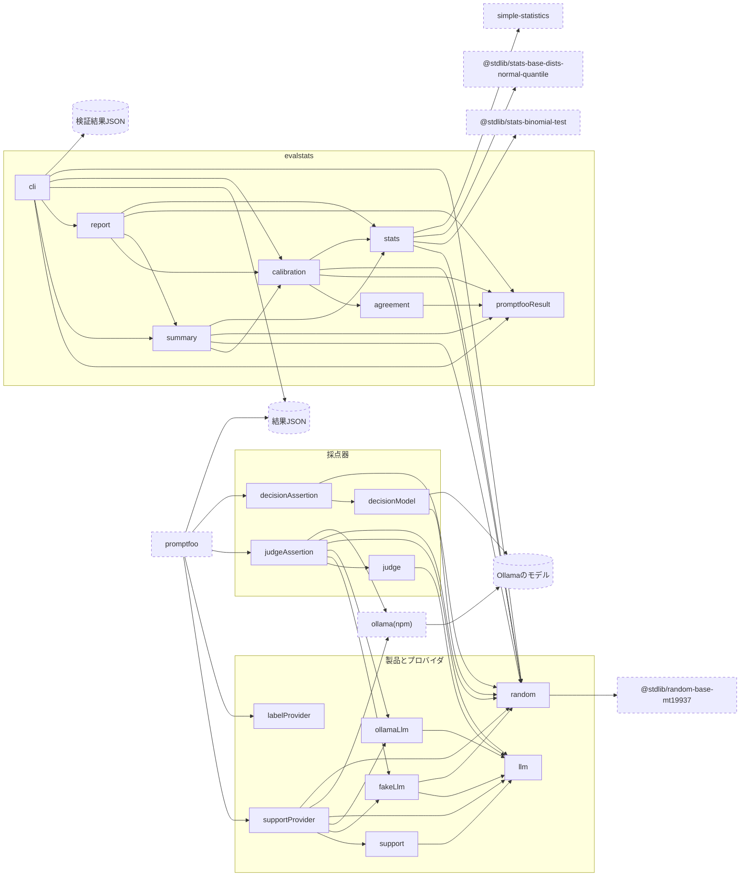

# モジュール依存図

製品側のモジュール(プロバイダ)と採点器のモジュール(アサーション)はpromptfooから呼ばれ，分析側の`evalstats`はpromptfooが書いた結果JSONを読む．
実線の矢印`A --> B`は，`A`が`B`をimportすることを表す．点線の枠は外部である．

- 非決定的なのは，外部の`Ollamaのモデル`だけである．`support`は`llm`のインタフェースだけに依存するため，テストでは`fakeLlm`を渡して決定的に確かめられる．
- `supportProvider`は，設定の`llm`に応じて`fakeLlm`の`keywordLlm`か，`ollamaLlm`と`ollama(npm)`のクライアントを組み立てる．
- 偽LLMの揺れは`random`の擬似乱数から作る．`supportProvider`は，シード，問い合わせ文，試行の番号から`trialSeed`で試行ごとのシードを作り，試行ごとに`keywordLlm`を組み立てる．promptfooが試行を並行に実行しても，各試行の出力は変わらない．
- `evalstats`は製品のモジュールをimportしない．promptfooの結果JSONだけを通して製品の評価結果を受け取る．
- 採点器のモジュールは，製品のLLMのポート(`llm`)と偽LLM(`fakeLlm`)を共有する．LLM Judgeは`judge`を，意思決定モデルは`decisionModel`のポートを通して呼ぶ．
- `decisionModel`のOllamaの実装は，`ollama(npm)`ではなく`fetch`で`/v1/systemone`を直接呼ぶ．
- `labelProvider`は，人手ラベルのスイート(`labels.yaml`)で返信をそのまま出力にし，採点器だけを動かす．
- `calibration`は，人の判定と採点器の結果を`agreement`で比べ，検証結果JSONに保存する．`summary`は検証結果を受け取り，合格率を補正する．
- 統計の計算は`stats`に集める．`summary`は区間と標準誤差を求めるために，`report`は区間の型を使うために`stats`をimportする．
